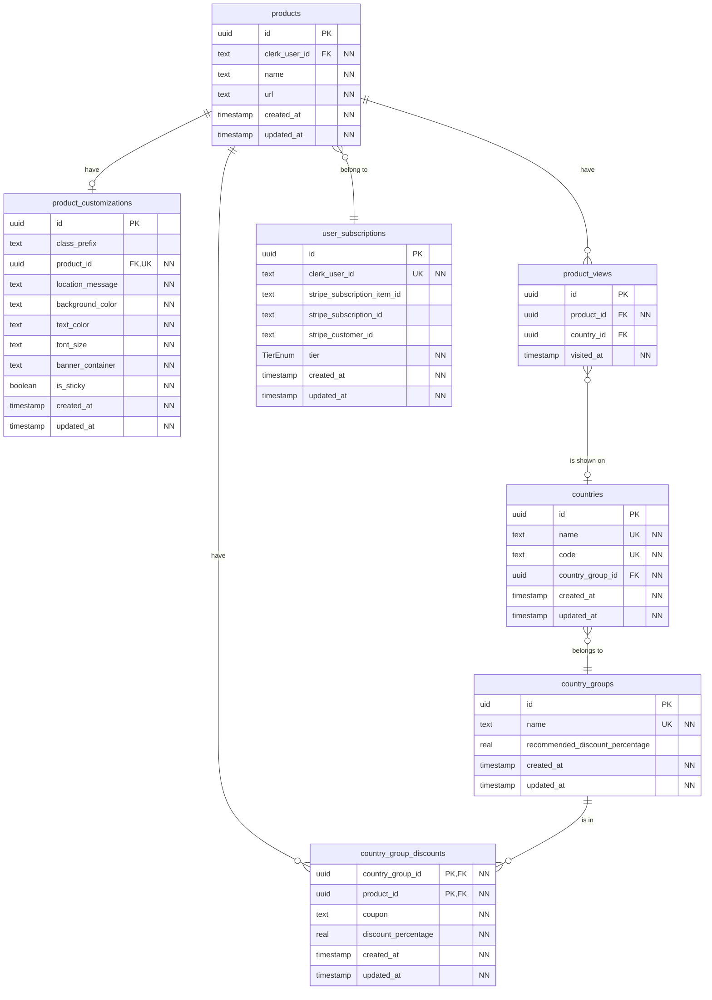

# Parity Deals clone

## Database Entity-Relationship Diagram

```mermaid
erDiagram
  products {
    uuid id PK
    text clerk_user_id FK "NN"
    text name "NN"
    text url "NN"
    timestamp created_at "NN"
    timestamp updated_at "NN"
  }

  product_customizations {
    uuid id PK
    text class_prefix
    uuid product_id FK, UK "NN"
    text location_message "NN"
    text background_color "NN"
    text text_color "NN"
    text font_size "NN"
    text banner_container "NN"
    boolean is_sticky "NN"
    timestamp created_at "NN"
    timestamp updated_at "NN"
  }

  country_groups {
    uid id PK
    text name UK "NN"
    real recommended_discount_percentage
    timestamp created_at "NN"
    timestamp updated_at "NN"
  }

  countries {
    uuid id PK
    text name UK "NN"
    text code UK "NN"
    uuid country_group_id FK "NN"
    timestamp created_at "NN"
    timestamp updated_at "NN"
  }

  product_views {
    uuid id PK
    uuid product_id FK "NN"
    uuid country_id FK
    timestamp visited_at "NN"
  }

  country_group_discounts {
    uuid country_group_id PK, FK "NN"
    uuid product_id PK, FK "NN"
    text coupon "NN"
    real discount_percentage "NN"
    timestamp created_at "NN"
    timestamp updated_at "NN"
  }

  user_subscriptions {
    uuid id PK
    text clerk_user_id UK "NN"
    text stripe_subscription_item_id
    text stripe_subscription_id
    text stripe_customer_id
    TierEnum tier "NN"
    timestamp created_at "NN"
    timestamp updated_at "NN"
  }

  products }o--|| user_subscriptions: "belong to"
  products ||--o| product_customizations : have
  products ||--o{ product_views : have
  products ||--o{ country_group_discounts : have
  product_views }o--o| countries: "is shown on"
  countries }o--|| country_groups: "belongs to"
  country_groups ||--o{ country_group_discounts: "is in"
```
